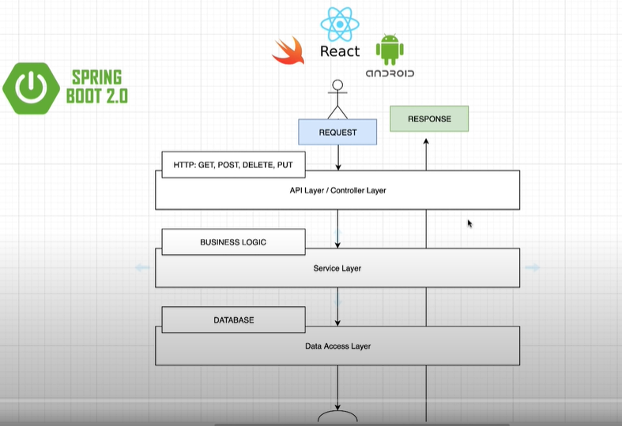
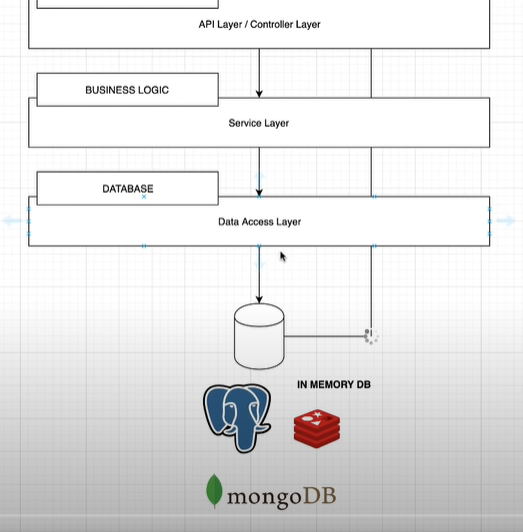

# DEMO for SpringBoot Java

### SpringBoot Structure:

_#1_ - Client\
_#2_ - Front-end GUI (Javascript)\
_#3_ - API Layer (Get, Post, Put, Delete)\
_#4_ - Service Layer\
_#5_ - Data Access Layer\
_#6_ - Database

### HTTP Requests:

**GET request -**
* Simple requests for information
* Should only retrieve data
* Shouldn't modify data 
* (e.g. getting employee's address)

 

**Post request -**
* Modify underlying data
* Create new resources
* (e.g: adding a new employee)

 

**Put request -**
* Modify underlying data
* Update already existing resources
* (e.g: updating an employee's info)

 

**Delete request -**
* Remove existing resources
* (e.g. delete an employee)